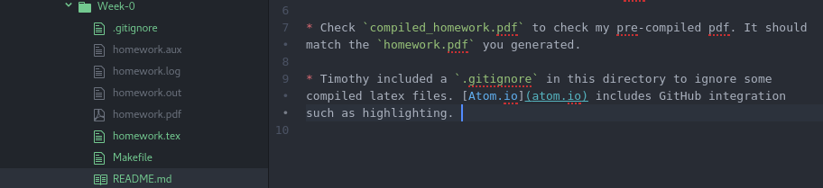

# Week 0: Example

## Homework 0

* If you're on Linux or MacOS and have `pdflatex` installed, you can run `make` to compile my homework file. If you're on Windows, you can compile the `homework.tex` file with your latex compiler. Either way, a `homework.pdf` should be generated.

* Compare your `homework.pdf` with my `compiled_homework.pdf`, they should match!

* I included a `.gitignore` in this directory to ignore some compiled latex files. This file will probably not show up in your file explorer unless you show hidden files. [Atom.io](atom.io) is a text editor that includes GitHub integration such as highlighting, Timothy loves it. The screenshot below shows how the files `homework.aux`, `homework.log`, `homework.out` and `homework.pdf` are excluded, and how files `.gitignore`, `homework.tex`, `Makefile`, and `README.md` are new:

